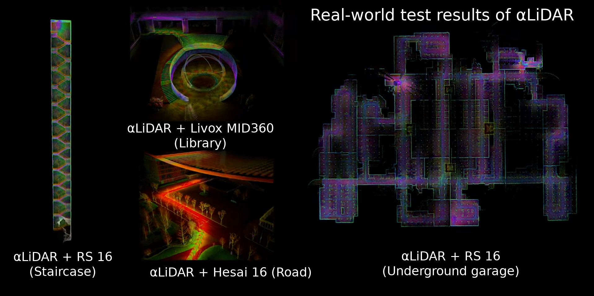

This is the official implementation of the paper **𝛼LiDAR: An Adaptive High-Resolution Panoramic LiDAR System (MobiCom 2024)**. 

# 𝛼LiDAR: An Adaptive High-Resolution Panoramic LiDAR System

LiDAR technology holds vast potential across various sectors, including robotics, autonomous driving, and urban planning. However, the performance of current LiDAR sensors is hindered by limited field of view (FOV), low resolution, and lack of flexible focusing capability. We introduce 𝛼LiDAR, an innovative LiDAR system that employs controllable actuation to provide a panoramic FOV, high resolution, and adaptable scanning focus.

## Demo video (YouTube)

## System overview 

The core concept of 𝛼LiDAR is to expand the operational freedom of a LiDAR sensor through the incorporation of a controllable, active rotational mechanism. This modification allows the sensor to scan previously inaccessible blind spots and focus on specific areas of interest in an adaptive manner. 

[//]: # (![Teaser&#41;]&#40;documents/teaser_pipeline.png&#41;)

## Hardware setup guide

### Bill of materials
| Component                  | Quantity | Detail                               | Link                                                                            |
|----------------------------|----------|--------------------------------------|---------------------------------------------------------------------------------|
| **Sensors**                |          |                                      |                                                                                 |
| Hesai Pandar XT-16 (*)     | 1        | LiDAR                                | [link](https://www.hesaitech.com/product_downloads/xt32-16/)                    |
| Yesense YIS100             | 1        | IMU                                  | [link](https://www.yesense.com/YIS100)                                          |
| Robomaster GM6020          | 1        | Motor / Encoder                      | [link](https://www.robomaster.com/en-US)                                        |
| **Mechanical Parts**       |          |                                      |                                                                                 |
| Central mounting structure | 1        | 3D printed part                      | [.step](hardware/Mechanical/center_mounting_structure.step)                     |
| Motor mounting base        | 1        | 3D printed part                      | [.step](hardware/Mechanical/motor_mounting_base.step)                           |
| Stand                      | 1        | 3D printed part                      | [.step](hardware/Mechanical/stand.step)                                         |
| M3 x 10mm screws           | 7        | Hex Socket Cap                       | -                                                                               |
| M4 x 10mm screws           | 7        | Hex Socket Cap                       | -                                                                               |
| M4 x 25mm screws+nuts      | 4        | Hex Socket Cap                       | -                                                                               |
| W1/4-20 screws             | 1        | Hex Socket Cap                       | -                                                                               |
| **Electronic Parts**       |          |                                      |                                                                                 |
| Control board              | 1        | PCB                                  | [link](hardware/PCB/EasyEDA_PCB_control_board.json)                             |
| Host machine interface     | 1        | PCB                                  | [link](hardware/PCB/EasyEDA_PCB_host_machine_interface.json)                    |
| STM32F103C8 Dev Board      | 1        | MCU                                  | [link](http://e.tb.cn/h.grrLx6RYA14IKhd?tk=78g03iXNOQm) |
| SP3232 Module              | 1        | RS232-TTL converter                  | [link](http://e.tb.cn/h.gJosLscFDzw8Mb8?tk=u5v037C8lvo)                         |
| TJA1050 CAN Module         | 1        | CAN controller                       | [link](http://e.tb.cn/h.gJRE7eLncdnfH2f?tk=bT1N37CR3JV)                         |
| CH340C SOP16               | 1        | USB-Serial converter                 | [link](http://e.tb.cn/h.gJLbUM7WQJP9YyL?tk=Q6bh37CsSeL)                         |
| SL2.1A SOP16               | 1        | USB hub controller                   | [link](http://e.tb.cn/h.gJ8WnEJFgmtsBG9?tk=nUKr37Cryhm)                         |
| RJ45 Socket                | 3        | Control board x1, interface board x2 | [link](http://e.tb.cn/h.gJRwBsI2jhjfMgq?tk=Blwl37Cjqox)                         |
| XH2.54 Socket              | 5        | 8pin x1, 4pin x2, 2pin x2            | [link](http://e.tb.cn/h.gJRx9rqzKRJdwGG?tk=2ZND37CQ6tV)                         |
| Gigabit Ethernet cable     | 1        | 8-line, for data transmission        | -                                                                               |

> (*) Or other LiDAR sensors, e.g., [Robosense RS16](https://www.robosense.ai/en) / [Livox MID360](https://www.livoxtech.com/) / [Livox Horizon](https://www.livoxtech.com/).

### Mechanical components setup

#### CAD models:
- Assembly diagram (Preview with [Free CAD](https://www.freecad.org/) and [A2plus plugin](https://wiki.freecad.org/A2plus_Workbench) )

[hardware/Mechanical/assembly.FCStd](hardware/Mechanical/assembly.FCStd)

- LiDAR-IMU-Motor central mounting structure

[hardware/Mechanical/center_mounting_structure.step](hardware/Mechanical/center_mounting_structure.step)

- Motor mounting base

[hardware/Mechanical/motor_mounting_base.step](hardware/Mechanical/motor_mounting_base.step)

- Stand

[hardware/Mechanical/stand.step](hardware/Mechanical/stand.step)

#### 3D printing instructions

Our CAD models are optimized for 3D printing to facilitate rapid prototyping and reproducing. 
The key parameters for the 3D printer are: 

- **Printing material:** Lanbo PLA+
- **Temperature:** 200C
- **Heat bed:** 60C
- **Cooling fan:** 100%
- **Nozzle diameter:** 0.4mm
- **Layer height:** 0.24mm
- **Wall line count:** 4
- **Top-bottom layers:** 4
- **Infill:** 60% Gyroid
- **Support:** On
- **Adhesion:** On 

For reference, we use a **SnapMaker A350 3D printer**, and use **Ultimaker Cura 4.9.1** for model slicing.

### Electronic components setup

#### PCBs

The circuit board for the electronic components consists of two parts:  **control board** and **host machine interface**.

The **control board** is mounted together with the Motor, LiDAR, IMU sensor, aggregating all sensor data onto a single RJ45 physical interface, and transmitting the data via a 8-line gigabit Ethernet cable; 

the **host machine interface** splits the 8-line gigabit Ethernet cable into a 4-line 100Mbps Ethernet and a USB 2.0 interface, connecting to the host computer.

- Control board PCB design file:

[hardware/PCB/EasyEDA_PCB_control_board.json](hardware/PCB/EasyEDA_PCB_control_board.json)

- Host machine interface PCB design file:

[hardware/PCB/EasyEDA_PCB_host_machine_interface.json](hardware/PCB/EasyEDA_PCB_host_machine_interface.json)

The PCB design files can be imported and previewed in [EasyEDA](https://easyeda.com/editor). After successful importation, the appearance of the PCB should look as shown in the following images:

The PCBs can be manufactured using [JLCPCB's PCB Prototype service](https://docs.lceda.cn/en/PCB/Order-PCB/), which has been integrated within EasyEDA.
The key parameters for PCB fabrication are listed below: 

- **Base Material:** FR-4
- **Layers:** 2
- **Product Type:** Industrial/Consumer electronics
- **PCB Thickness:** 1.6
- **Surface Finish:** HASL(with lead)
- **Outer Copper Weight:** 1oz
- **Min via hole size/diameter:** 0.3mm
- **Board Outline Tolerance:** +-0.2mm 

To assemble the MCU and other electronic components onto the PCB, we can use [JLCPCB's SMT service](https://jlcpcb.com/smt-assembly), or solder by hand. The fully assembled PCB is shown in the following images:

#### Firmware

The firmware needs to be programmed into the STM32 MCU on the control board. It includes all the functionalities necessary for the board to operate properly, including data acquisition from multiple sensors, time synchronization,  protocol conversion, etc. 

The hex file of the firmware:
[hardware/Firmware/stm32f103c8t6.hex](hardware/Firmware/stm32f103c8t6.hex)

To program the firmware onto the MCU, we need an [ST-LINK V2](https://www.st.com/en/development-tools/st-link-v2.html) programmer. Please refer to the programming process outlined in the[STM32CubeProgrammer user manual](https://www.st.com/resource/en/user_manual/um2237-stm32cubeprogrammer-software-description-stmicroelectronics.pdf).

## Software setup guide (Under construction)
### Run with docker (Recommanded)

[//]: # (### Dependencies)

[//]: # ()
[//]: # (### Build)

[//]: # ()
[//]: # (### Run)

### Build from scratch

[//]: # (### Dependencies)

[//]: # ()
[//]: # (### Build)

[//]: # ()
[//]: # (### Run)

[//]: # (Github repository: https://github.com/HViktorTsoi/alpha_lidar)
