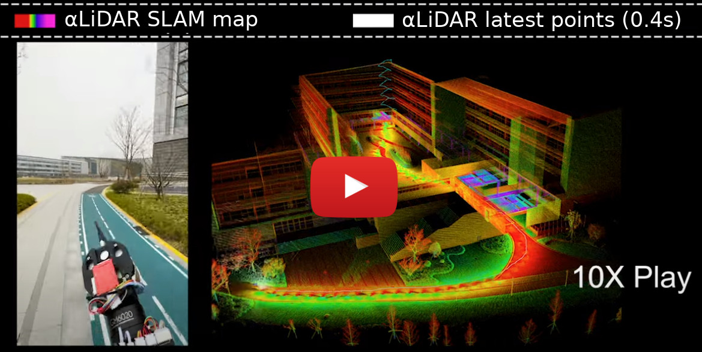
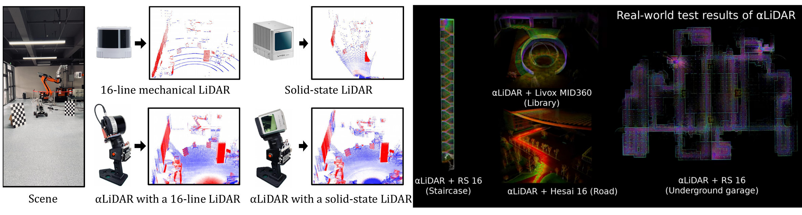
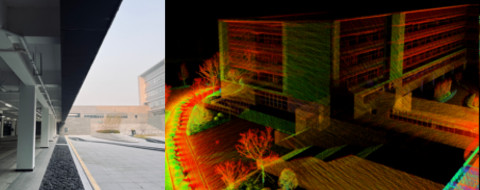

This is the official implementation of the paper **𝛼LiDAR: An Adaptive High-Resolution Panoramic LiDAR System (MobiCom 2024)**. 


# 𝛼LiDAR: An Adaptive High-Resolution Panoramic LiDAR System

The performance of current LiDAR sensors is hindered by limited field of view (FOV), low resolution, and lack of flexible focusing capability. We introduce 𝛼LiDAR, an innovative LiDAR system that employs controllable actuation to provide a panoramic FOV, high resolution, and adaptable scanning focus. See our demos below $\color{red}{\textbf{(3.7k+ views)}}$:


## Demo Video (YouTube)
[](https://www.youtube.com/watch?v=x4zc_I_xTaw)

## System Overview 

The core concept of 𝛼LiDAR is to expand the operational freedom of a LiDAR sensor through the incorporation of a controllable, active rotational mechanism. This modification allows the sensor to scan previously inaccessible blind spots and focus on specific areas of interest in an adaptive manner. A major challenge with 𝛼LiDAR is that rapid rotations result in highly distorted point clouds. Our solution focuses on accurately estimating the LiDAR sensor’s pose during rapid rotations to effectively correct and reconstruct the point cloud.




# Table of Contents
This repository contains the hardware specifications, software, and datasets for reproducing and evaluating 𝛼LiDAR:

[//]: # (- [Demo video &#40;YouTube&#41;]&#40;#demo-video-youtube&#41;)
[//]: # (- [System Overview]&#40;#system-overview&#41;)
- [How to Use This Repo](#how-to-use-this-repo)
- [:gear: I. Hardware Guideline](#gear-i-hardware-guideline)
  - [1. Bill of Materials](#1-bill-of-materials)
  - [2. Build the Mechanical Components](#2-build-the-mechanical-components)
  - [3. Setup the Electronic Components](#3-setup-the-electronic-components)
- [:minidisc: II. Datasets](#minidisc-ii-prepare-code-and-datasets)
- [:scroll: III. Software Guideline](#scroll-iii-software-guideline)
  - [Run with Docker (Recommended)](#run-with-docker-recommended)
  - [Build Source from Scratch](#build-source-from-scratch)
- [License](#license)


# How to Use This Repo:

We offer two approaches for reproducing 𝛼LiDAR:

### Approach 1: Build the hardware from scratch, and then test 𝛼LiDAR's algorithm.

We provide a detailed hardware guideline, including design files and production parameters for mechanical and electronic parts, along with a step-by-step replication tutorial. 
Once the hardware is set up, users can collect datasets and test 𝛼LiDAR in real-time and on-site.
To begin, please refer to the [⚙️ I. Hardware guideline](#gear-i-hardware-guideline) and follow the instructions in the specified order.


### Approach 2: Directly test 𝛼LiDAR's core algorithm with pre-collected datasets.

We also provide pre-collected datasets with 𝛼LiDAR's. These datasets allow the users to directly test the performance of 𝛼LiDAR's core software components. 
For this approach, please directly refer to  [:minidisc: II. Prepare code and datasets](#minidisc-ii-prepare-code-and-datasets) and [# :scroll: III. Software guideline](#scroll-iii-software-guideline). 

# :gear: I. Hardware Guideline

𝛼LiDAR enhances its sensing ability by incorporating an activate rotation mechanism in the FoV-limited directions in the physical layer, therefore, implementing the complete hardware system is important. 
In this section, we will demonstrate the assembly of the hardware in detail, including the setup of sensors, mechanical structures and electronic components. 
We provide comprehensive Bill of Materials, 3D printing instructions, PCB designing and manufacturing details and firmware setup guides to ensure easy replication of 𝛼LiDAR. 
Following this guide, users can reproduce the full 𝛼LiDAR hardware system, as shown bellow, for data collection and performance validation.


## 1. Bill of Materials

This section provides all materials required to replicate 𝛼LiDAR, including sensors, mechanical parts, electronic components, etc. 
Please prepare these materials before building 𝛼LiDAR.

Starting with sensors and actuators, 𝛼LiDAR requires a LiDAR with PPS/GPRMC time synchronization support (which is commonly built into most LiDARs).
𝛼LiDAR also requires an IMU and an encoder for state estimation, and a gimbal motor as the actuator for the active motion. The encoder is usually integrated into the gimbal motor such as DJI GM6020.
Specific models of these components are listed in the table below:

<details>
<summary>Click here to show the material list</summary>

| Component                  | Quantity | Detail                               | Link                                                                            |
|----------------------------|----------|--------------------------------------|---------------------------------------------------------------------------------|
| Hesai Pandar XT-16 (*)     | 1        | LiDAR with PPS+GPRMC sync support    | [link](https://www.hesaitech.com/product_downloads/xt32-16/)                    |
| Yesense YIS100             | 1        | IMU                                  | [link](https://www.yesense.com/YIS100)                                          |
| Robomaster GM6020          | 1        | Motor / Encoder                      | [link](https://www.robomaster.com/en-US)                                        |
> (*) Or other LiDAR sensors, e.g., [Robosense RS16](https://www.robosense.ai/en) / [Livox MID360](https://www.livoxtech.com/) / [Livox Horizon](https://www.livoxtech.com/).

</details>


Next, here are the mechanical and electronic parts required. Most of them can be purchased online with low cost. The purchase links are also provided if available.


<details>
<summary>Click here to show the material list</summary>

| Component                  | Quantity | Detail                                      | Link                                                         |
|----------------------------|----------|---------------------------------------------|--------------------------------------------------------------|
| **Mechanical Parts**       |          |                                             |                                                              |
| LanBo PLA+  filement       | 1        | 3D printing filement                        | [link](http://e.tb.cn/h.gsp9zhNGv3aDk1e?tk=9Jja38xDsqf)      |
| Central mounting structure | 1        | 3D printed part                             | [.step](hardware/Mechanical/center_mounting_structure_hesai.step)  |
| Motor mounting base        | 1        | 3D printed part                             | [.step](hardware/Mechanical/motor_mounting_base.step)        |
| Stand                      | 1        | 3D printed part                             | [.step](hardware/Mechanical/stand.step)                      |
| Hex socket cap screws      | 18       | 7 x M3 x 10mm, 7 x M4 x 10mm, 4 x M4 x 25mm | -                                                            |
| W1/4-20 screws             | 1        | -                                           | -                                                            |
| **Electronic Parts**       |          |                                             |                                                              |
| Control board              | 1        | PCB                                         | [link](hardware/PCB/EasyEDA_PCB_control_board.json)          |
| Host machine interface     | 1        | PCB                                         | [link](hardware/PCB/EasyEDA_PCB_host_machine_interface.json) |
| STM32F103C8 Dev Board      | 1        | MCU                                         | [link](http://e.tb.cn/h.grrLx6RYA14IKhd?tk=78g03iXNOQm)      |
| SP3232 Module              | 1        | RS232-TTL converter                         | [link](http://e.tb.cn/h.gJosLscFDzw8Mb8?tk=u5v037C8lvo)      |
| TJA1050 CAN Module         | 1        | CAN controller                              | [link](http://e.tb.cn/h.gJRE7eLncdnfH2f?tk=bT1N37CR3JV)      |
| CH340C SOP16               | 1        | USB-Serial converter                        | [link](http://e.tb.cn/h.gJLbUM7WQJP9YyL?tk=Q6bh37CsSeL)      |
| SL2.1A SOP16               | 1        | USB hub controller                          | [link](http://e.tb.cn/h.gJ8WnEJFgmtsBG9?tk=nUKr37Cryhm)      |
| 0805 chip beads            | 1        | EMI protection                              | [link](http://e.tb.cn/h.gHOAsfEj4iIVgE7?tk=P8kt38CdGI0)      |
| RJ45 Socket                | 3        | Control board x1, interface board x2        | [link](http://e.tb.cn/h.gJRwBsI2jhjfMgq?tk=Blwl37Cjqox)      |
| XH2.54 Socket              | 5        | 8pin x1, 4pin x2, 2pin x2                   | [link](http://e.tb.cn/h.gJRx9rqzKRJdwGG?tk=2ZND37CQ6tV)      |
| Gigabit Ethernet cable     | 1        | 8-line, for data transmission               | -                                                            |

</details>

## 2. Build the Mechanical Components

𝛼LiDAR's mechanical components including the structural parts for mounting the LiDAR, IMU, Motor, and the control board. 
Our design is optimized for 3D printing to facilitate rapid prototyping and reproducing. 

### 2.1 Prepare the CAD Models:
First, download the following CAD models of the mechanical components. 
The user can preview the assembly diagram and the part files with [FreeCAD](https://www.freecad.org/) software and [A2plus plugin](https://wiki.freecad.org/A2plus_Workbench).

<details>
<summary>Click here to show the CAD files: </summary>

- Assembly diagram: 

[hardware/Mechanical/assembly.FCStd](hardware/Mechanical/assembly.FCStd)

- LiDAR-IMU-Motor central mounting structure (for Hesai Pandar XT16)

[hardware/Mechanical/center_mounting_structure_hesai.step](hardware/Mechanical/center_mounting_structure_hesai.step)

- LiDAR-IMU-Motor central mounting structure (for Robosense RS16)

[hardware/Mechanical/center_mounting_structure_rs16.step](hardware/Mechanical/center_mounting_structure_rs16.step)

- Motor mounting base

[hardware/Mechanical/motor_mounting_base.step](hardware/Mechanical/motor_mounting_base.step)

- Stand

[hardware/Mechanical/stand.step](hardware/Mechanical/stand.step)

</details>

### 2.2 Build the Components with a 3D Printer

The users can then import the above STEP files into a 3D printing slicing software, set the printing parameters to generate the `.gcode` files, and then use a 3D printer to build the parts.
For reference, we use a **SnapMaker A350 3D printer**, and use **Ultimaker Cura 4.9.1** for model slicing.

<details>
<summary>Click here to show the key parameters for 3D printing: </summary>

- **Printing material:** Lanbo PLA+
- **Temperature:** 200C
- **Heat bed:** 60C
- **Cooling fan:** 100%
- **Nozzle diameter:** 0.4mm
- **Layer height:** 0.24mm
- **Wall line count:** 4
- **Top-bottom layers:** 4
- **Infill:** 60% Gyroid
- **Support:** On
- **Adhesion:** On 
- **Build plate adhesion type:** Brim

</details>

To ensure that the printed parts have sufficient layer strength during rapid rotations, we require specific placement for the models in the slicing software.
The orientation of the sliced models should be positioned like this:


## 3. Setup the Electronic Components

𝛼LiDAR's electronic components mainly consists of two PCBs:  the **control board** and the **host machine interface**.

The **control board** is mounted together with the Motor, LiDAR, IMU sensor, aggregating all sensor data onto a single RJ45 physical interface, and transmitting the data via a 8-line gigabit Ethernet cable; 

the **host machine interface** splits the 8-line gigabit Ethernet cable into a 4-line 100Mbps Ethernet and a USB 2.0 interface, connecting to the host computer.

### 3.1 Preview the PCB Designing Files

<details>
<summary>Click here to show the PCB design files: </summary>

- Control board PCB design file:

[hardware/PCB/EasyEDA_PCB_control_board.json](hardware/PCB/EasyEDA_PCB_control_board.json)

- Host machine interface PCB design file:

[hardware/PCB/EasyEDA_PCB_host_machine_interface.json](hardware/PCB/EasyEDA_PCB_host_machine_interface.json)

</details>

The PCB design files can be imported and previewed in [EasyEDA](https://easyeda.com/editor). After successful importation, the appearance of the PCB should look as shown in the following images:


### 3.2 Manufacture the PCBs

The PCBs can be manufactured using [JLCPCB's PCB Prototype service](https://docs.lceda.cn/en/PCB/Order-PCB/), which has been integrated within EasyEDA.

<details>
<summary>Click here to show the key parameters for PCB fabrication: </summary>

- **Base Material:** FR-4
- **Layers:** 2
- **Product Type:** Industrial/Consumer electronics
- **PCB Thickness:** 1.6
- **Surface Finish:** HASL(with lead)
- **Outer Copper Weight:** 1oz
- **Min via hole size/diameter:** 0.3mm
- **Board Outline Tolerance:** +-0.2mm

</details>

To assemble the MCU and other electronic components onto the PCB, we can use [JLCPCB's SMT service](https://jlcpcb.com/smt-assembly), or solder by hand. The fully assembled PCB is shown in the following images:


### 3.3 Uploading the Firmware

The firmware needs to be programmed into the STM32 MCU on the control board. It includes all the functionalities necessary for the board to operate properly, including data acquisition from multiple sensors, time synchronization,  protocol conversion, etc. 

The hex file of the firmware:
[hardware/Firmware/stm32f103c8t6.hex](hardware/Firmware/stm32f103c8t6.hex)

To program the firmware onto the MCU, we need an [ST-LINK V2](https://www.st.com/en/development-tools/st-link-v2.html) programmer. Please refer to the programming process outlined in the[STM32CubeProgrammer user manual](https://www.st.com/resource/en/user_manual/um2237-stm32cubeprogrammer-software-description-stmicroelectronics.pdf).

# :minidisc: II. Prepare Code and Datasets

We also provide multiple pre-collected datasets to test 𝛼LiDAR's performance if the hardware is not available. The dataset can be downloaded at [Mega Drive](https://mega.nz/folder/fEpwARjD#AVRIQ-gzrFtTJn6fuwmXng) or [Baidu Pan (Code: u0tr)](https://pan.baidu.com/s/1nzBAgfkNCF8X1rAMBUw8Rg).

**Dataset description:**

| Test dataset                       | Description                                                    |       Scene image and map        |
|------------------------------------|----------------------------------------------------------------|:--------------------------------:|
| alpha_lidar_large_indoor.bag       | Indoor environment with narrow corridors and reflective floors |  |
| alpha_lidar_various_scene.bag      | Hybrid indoor and outdoor environment                          |  |
| alpha_lidar_15floors_staircase.bag | 15-Floor narrow stairwell                                      |  |


To use our code and datasets, first, clone this repository:
```shell
git clone https://github.com/HViktorTsoi/alpha_lidar.git
```

Download the datasets and save to this path: 
```shell
${path_to_alpha_lidar}/datasets
```
`${path_to_alpha_lidar}` is the path to the source code just been cloned. 

After downloading, the `alpha_lidar/datasets` directory should look like this:

```shell
|-- datasets
|---- alpha_lidar_15floors_staircase.bag
|---- alpha_lidar_large_indoor.bag
|---- alpha_lidar_large_indoor.fusion.gt
|---- alpha_lidar_various_scene.bag
|---- alpha_lidar_various_scene.f9p.gt
```
The `*.bag` files store the raw data (LiDAR point cloud, IMU and Encode messages), while the corresponding `*.gt` files store the ground truth data.


# :scroll: III. Software Guideline


In this section, we demonstrate how to run and evaluate 𝛼LiDAR's core software module, which addresses 𝛼LiDAR' main challenges: accurately estimating the LiDAR's poses and recovering undistorted LiDAR measurements under the rapid motion of both the LiDAR and the carrier.

We offer two methods for running the 𝛼LiDAR code: 
[running with docker (we recommend)](#run-with-docker-recommended) and [building the source code from scratch](#build-source-from-scratch).

## Run with Docker (Recommended)
### Prerequisites

- Ubuntu 18.04 or later
- NVIDIA GPU Driver
- [docker](https://docs.docker.com/get-docker/)
- [nvidia-docker2](https://docs.nvidia.com/datacenter/cloud-native/container-toolkit/install-guide.html)
- [docker-compose](https://docs.docker.com/compose/install/linux/#install-using-the-repository)

### 1. Setup Docker Environment
First, pull our preconfigured environment from docker hub
```shell
docker pull hviktortsoi/ubuntu2004_cuda_ros:latest
```
Then, enter the `docker` directory in the source code

```shell
cd ${path_to_alpha_lidar}/software/docker
```
`${path_to_alpha_lidar}` is the path where the source code just been cloned. 

Before start the container, configure `xhost` on the host machine by:
```shell
sudo xhost +si:localuser:root
```

Then launch and enter the docker container:
```shell
sudo docker-compose run alpha-lidar bash
```

### 2. Run and Evaluate

The following steps are all executed in the bash terminal inside the docker container. 
#### 2.1 Run αLiDAR

Taking the `alpha_lidar_various_scene.bag` dataset as an example, to launch αLiDAR's `state estimation` module, execute:

```shell
roslaunch state_estimation mapping_robosense.launch bag_path:=/datasets/alpha_lidar_large_indoor.bag
```
After launching, press `space` key in the **bash terminal** to begin data playback.

If everything is working smoothly, two RVIZ GUI windows will show up:

The first RVIZ window shows the visualization of αLiDAR's **point cloud maps** and **estimated poses**. 


The smaller second window shows the comparison result, which is naïvely stacking the raw point clouds without αLiDAR's pipeline.

[//]: # (![result]&#40;documents/result3.jpg&#41;)


Additionally, the bash terminal will display the debug information like data playback time, real-time latency, etc.

Users can use the mouse **Left-click**, **Middle-scroll** and **Middle-click** to move the viewpoint in the RVIZ GUI to observe a more comprehensive point cloud map. 

During visualization, if the users lost the point cloud view, press `z` key in the RVIZ GUI to reset the viewpoint;
If the point clouds are not clear, try increasing the `Size (m)` parameter (e.g., to 0.05) in the left configuration panel to make the point cloud more visible.


#### 2.2 Evaluate αLiDAR's Performance
After completing data playback, press CTRL+C in the  **bash terminal** to exit `state estimation`.

To evaluate αLiDAR's performance，execute：
```shell
rosrun state_estimation evaluation.py --gt_path /datasets/alpha_lidar_large_indoor.fusion.gt
```
It shows the evaluation results of trajectory precision, latency, FoV coverage, etc.


#### 2.3 Other Datasets
For `alpha_lidar_15floors_staircase.bag` dataset, execute the following commands to run and evaluate:
```shell
# run
roslaunch state_estimation mapping_robosense.launch bag_path:=/datasets/alpha_lidar_15floors_staircase.bag
# evaluate
rosrun state_estimation evaluation.py 
```

For `alpha_lidar_various_scene.bag` dataset, execute the following commands to run and evaluate, note that a different `.launch` file is used here:
```shell
# run
roslaunch state_estimation mapping_hesai.launch bag_path:=/datasets/alpha_lidar_various_scene.bag
# evaluate
rosrun state_estimation evaluation.py --gt_path /datasets/alpha_lidar_various_scene.f9p.gt
```
[//]: # (![Teaser&#41;]&#40;documents/teaser_slam.jpg&#41;)

## Build Source from Scratch

### Prerequisites
#### System-level requirements:
- **Ubuntu 18.04 or later.**
- **ROS melodic or later.** Follow [ROS Installation](http://wiki.ros.org/ROS/Installation).
- **PCL 1.8 or later.** Follow [PCL Installation](http://www.pointclouds.org/downloads/linux.html).
- **Eigen 3.3.4 or later.** Follow [Eigen Installation](http://eigen.tuxfamily.org/index.php?title=Main_Page).
- **livox_ros_driver1.** Follow [livox_ros_driver Installation](https://github.com/Livox-SDK/livox_ros_driver).
> *Remarks:* The **livox_ros_driver** must be installed and **sourced** before run any 𝛼LiDAR's state_estimation launch file.

> *Remarks:* How to source? The easiest way is add the line ``` source $Livox_ros_driver_dir$/devel/setup.bash ``` to the end of file ``` ~/.bashrc ```, where ``` $Livox_ros_driver_dir$ ``` is the directory of the livox ros driver workspace (should be the ``` ws_livox ``` directory if you completely followed the livox official document).

#### Python requirements:
- Python 3.7 or later
- [evo](https://github.com/MichaelGrupp/evo)
- opencv-python
- ros_numpy
- transforms3d

### 1. Build
Enter the catkin workspace directory:
```shell
cd ${path_to_alpha_lidar}/software/alpha_lidar_ws
```

`${path_to_alpha_lidar}` is the path where the source code just been cloned. 

Then compile the code

```shell
catkin_make -DCATKIN_WHITELIST_PACKAGES="state_estimation"
```

and source

```shell
source ./devel/setup.bash
```

### 2. Run and Evaluate
This process follows the same steps as outlined in the [Run with Docker (Recommended)](#run-with-docker-recommended), 
please refer to this section [2. Run and Evaluate](#2-run-and-evaluate) for detailed instructions.


# License
This repository is released under the MIT license. See [LICENSE](LICENSE) for additional details.
